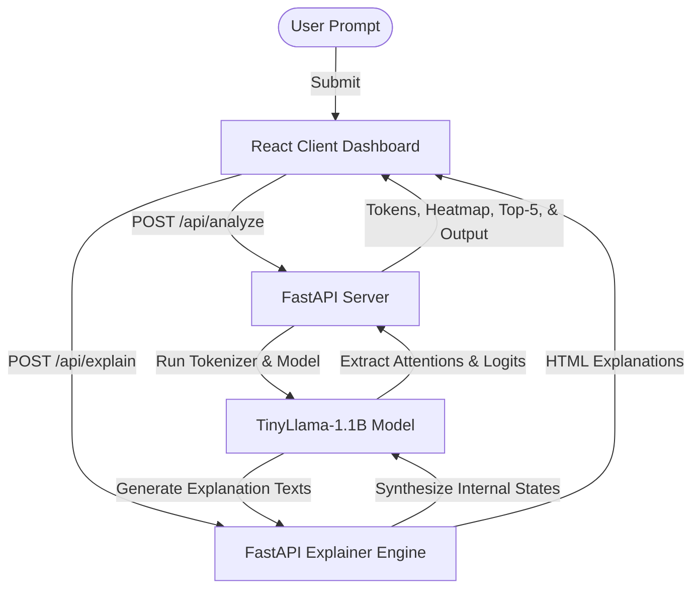

# ⬡ Neural Observatory — LLM Inference Visualizer

[](https://fastapi.tiangolo.com)
[](https://react.dev)
[](https://pytorch.org)
[](https://vitejs.dev)
[](https://tailwindcss.com)

Neural Observatory is an interactive, premium web application designed to act as a real-time microscope for causal Language Models. Specifically powered by a local **TinyLlama-1.1B-Chat** model, it visualizes the step-by-step tokenization process, multi-head attention weights across layers, next-token Softmax probability distributions, and generates real-time, plain-English explanations of its own internal states.

---

## 🔮 Key Features

- **🔤 Token Sequence Stream:** Highlights tokenizer boundary splits, displays vocabulary IDs, and identifies character-to-token mapping.
- **🔥 Interactive Attention Matrix:** A scrollable, cross-token multi-head attention heatmap displaying focus shifts between early, middle, and late layers.
- **📊 Probability Analytics:** Tracks and visualizes Softmax top-5 prediction alternatives with responsive, animated tracking bars for each selected token position.
- **🧠 Model Explainer Panel:** Uses prompt engineering on the underlying model to dynamically generate plain-English explanations of tokenization splits, attention focuses, and prediction criteria.
- **✍️ Typewriter Output Strip:** Displays the model's actual response completion using a smooth, premium typewriter animation sequence.

---

## 📁 Repository Structure

```
├── backend/
│   ├── main.py              # FastAPI server (Tokenization, Inference, and Explanations)
│   ├── requirements.txt     # Python dependencies
│   └── .venv/               # Virtual environment (ignored)
└── frontend/
    ├── src/                 # React & Vite source code
    │   ├── App.jsx          # Main client interface
    │   ├── components/      # UI components (Attention Heatmap, Response Box, Token Strip)
    │   └── index.css        # Core custom styles & theme configuration
    ├── package.json         # Frontend Node package configuration
    └── index.html           # Application root entry
```

---

## 🏗️ Architecture & Data Flow

Below is the conceptual structure showing how the frontend, FastAPI server, and PyTorch model interact:



---

## ⚡ Getting Started

### Prerequisites
- **Python 3.10+**
- **Node.js 18+**
- **CUDA-capable GPU** (Optional; automatically falls back to CPU if CUDA is unavailable)

### Setup Instructions

#### 1. Backend Setup (FastAPI)

1. Navigate to the backend directory:
   ```bash
   cd backend
   ```
2. Create and activate a virtual environment:
   ```bash
   python -m venv .venv
   # On Windows (CMD/PowerShell):
   .venv\Scripts\activate
   # On macOS/Linux:
   source .venv/bin/activate
   ```
3. Install dependencies:
   ```bash
   pip install -r requirements.txt
   ```
4. Start the FastAPI development server:
   ```bash
   python -m uvicorn main:app --host 0.0.0.0 --port 8000 --reload
   ```

*Note: On first execution, the backend will download `TinyLlama/TinyLlama-1.1B-Chat-v1.0` (~2.2 GB) directly from HuggingFace to your local cache.*

#### 2. Frontend Setup (React + Vite)

1. Open a new terminal window and navigate to the frontend directory:
   ```bash
   cd frontend
   ```
2. Install npm packages:
   ```bash
   npm install
   ```
3. Start the Vite development server:
   ```bash
   npm run dev
   ```

Open your browser and navigate to **`http://localhost:5173`** to access the dashboard.

---

## 🔌 API Endpoints

The backend exposes a Swagger UI for interactive testing at `http://localhost:8000/docs`.

| Method | Endpoint | Description |
| :--- | :--- | :--- |
| `GET` | `/` | Service health check & model loading status |
| `POST` | `/api/analyze` | Processes input text and extracts tokens, layered attention matrices, and logits |
| `POST` | `/api/explain` | Generates text explanations for tokens, layer attention shifts, and predictions |

---

## 📜 License

This project is licensed under the MIT License. Feel free to use and adapt it for educational and personal use.
